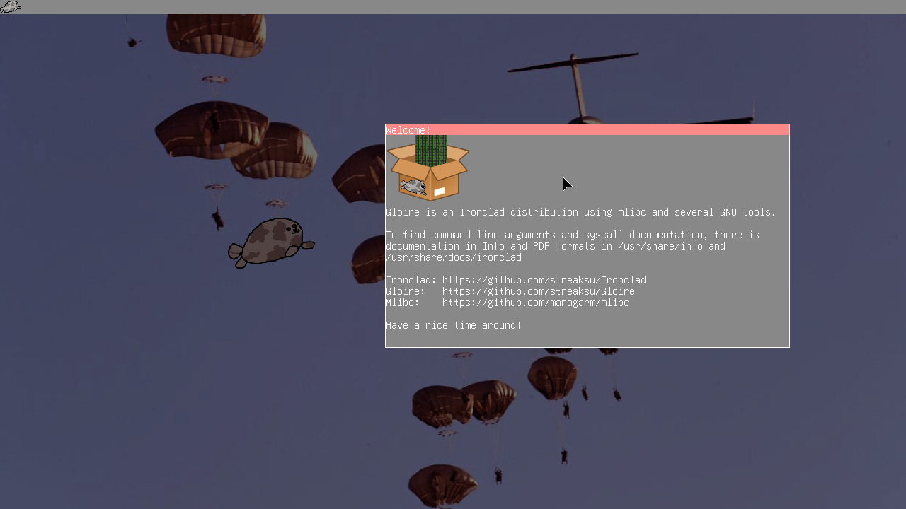

<p align="center">
    
</p>

# Gloire



Gloire is an OS built with the [Ironclad](https://github.com/streaksu/ironclad)
kernel and using GNU tools for the userland, along with some original
applications like `gwm`. This repository holds scripts and tools to build the
OS from the ground up.

Gloire is named after the [french ironclad](https://en.wikipedia.org/wiki/French_ironclad_Gloire),
which was the first ocean-going vessel of its kind.

## Building

The project uses `xbstrap`, which can be adquired easily from pip:

```bash
pip install xbstrap
```

Once `xbstrap` is installed, one can do the following to build the project:

```bash
make build && cd build # Prepare a directory and switch to it.
xbstrap init ..        # Prepare xbstrap.
xbstrap install --all  # Tell xbstrap to install all the packages.
```

A bootable ISO image can be generated running `xbstrap run make-iso`, and it
can be booted using a machine and a USB or QEMU, with a command like:
```bash
qemu-system-x86_64 -enable-kvm -cpu host -m 2G -smp 4 -hda gloire.hdd
```

A list of the tools needed for compilation of the OS are:

- `autoconf` 2.69 and `automake`.
- An Ada compiler, preferably `gcc`.
- A standard linker and GAS assembler.
- `xorriso` and QEMU for testing.

## Thanks to

- [Mintsuki](https://github.com/mintsuki) for the limine bootloader and help
setting it up.
- [The managarm project](https://github.com/managarm) for making xbstrap and
most of the recipes.
