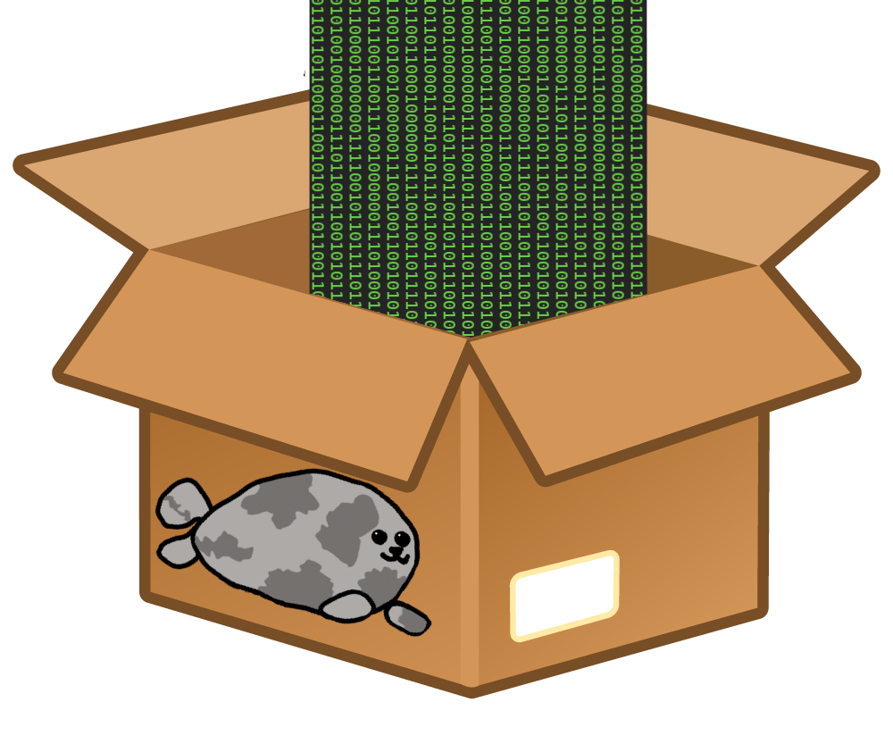
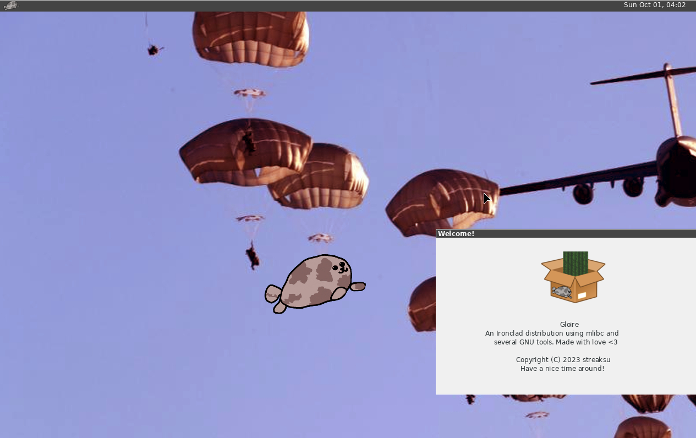
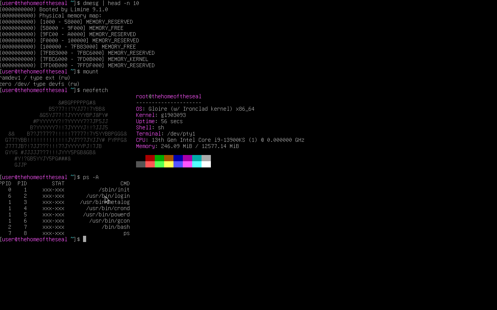
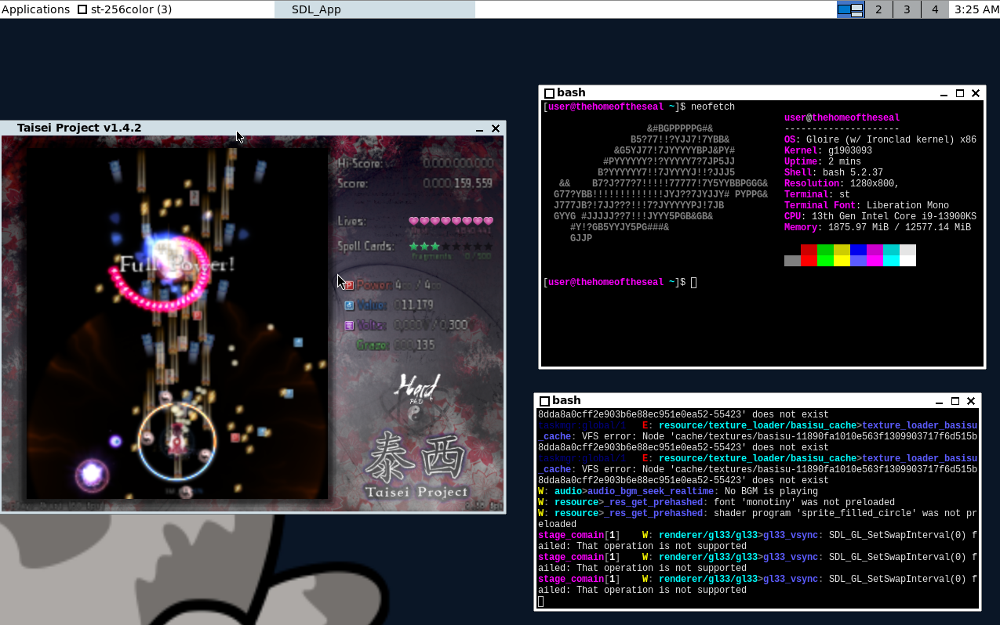
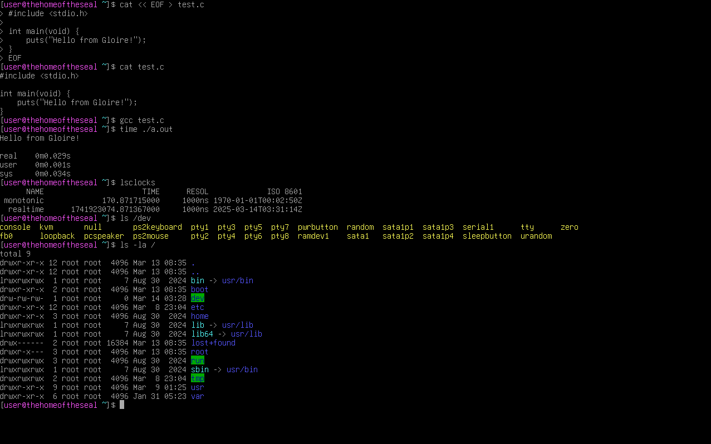

# Gloire

[]()

Gloire is an OS built with the [Ironclad](https://ironclad-os.org)
kernel and using GNU tools for the userland, along with some original
applications like `util-ironclad`. This repository holds scripts and tools to
build the OS from the ground up on a Linux-based system.

Gloire is named after the [French ironclad](https://en.wikipedia.org/wiki/French_ironclad_Gloire),
which was the first ocean-going vessel of its kind.






## Downloading

One can grab a pre-built Gloire live ISO [here](https://codeberg.org/Ironclad/Gloire/releases).

## Running

> [!IMPORTANT]
> For information on the current hardware requirements of the
> kernel, please visit [Ironclad's hardware support section](https://ironclad-os.org/supportedhardware.html).

### On virtual machines

One can run either the downloaded live ISO image or a
locally built image with an emulator like QEMU. For using QEMU with an x86_64
ISO, one can do:

```bash
qemu-system-x86_64 -enable-kvm -cpu host,migratable=off -m 8G -M q35 -cdrom gloire.iso -boot d -serial stdio
```

Where `gloire.iso` is your image of choice, and optionally attaching additional storage (HDDs) as needed,
for installations.

> [!NOTE]
> Depending on your distribution, to use Linux's KVM, you might need to add your
> user to the `kvm` usergroup, as such:
> ```bash
> usermod -aG kvm <user>
> ```
> Then log out and log back in.

To do the same with a riscv64 image, one can do:

```bash
qemu-system-riscv64 -M virt,acpi=on -cpu rv64,svpbmt=on -device ramfb \
  -device qemu-xhci -m 4G -device usb-kbd -device usb-tablet -serial stdio \
  -drive if=pflash,unit=0,format=raw,file=<firmware image>,readonly=on \
  -cdrom gloire.iso
```

For riscv64, UEFI firmware can be obtained
[from these EDK2 project binary builds](https://github.com/osdev0/edk2-ovmf-stable-bins/releases/latest/download/edk2-ovmf-bins.tar.xz)
(alongside other architectures' firmware, in compressed form).

### On physical hardware

Gloire should run fine on any 64-bit x86 machine and most 64-bit UEFI-capable
RISC-V boards. To run it, one can burn a Gloire live ISO to a USB flash drive
or optical media and boot from it.

## Contributing and bug reporting

Gloire accepts contributions for new packages or any other kind of changes
using the pull request system baked into Codeberg. Check our
[contribution information](CONTRIBUTING.md).

## Joining the community

You can visit our list of community channels on Ironclad's
[community tab](https://ironclad-os.org/community.html).

## Building

A list of the tools needed for compilation of the OS are:

- `bash`, `awk`, `find` and `xargs` (from `findutils`), `free` (from `procps`), `git`, `GNU make`, `grep`, `gzip`, `sed`, `tar`, `unshare` (from `util-linux`), `wget`, and `zstd` for Jinx.
- `fallocate`, `mount` and `umount` (from `util-linux`), `mkfs.ext2` (from `e2fsprogs`), and `xorriso` (from `libisoburn`) for building the image.
- `sudo` for the steps that have to run as root. Another tool, like `doas`, can be used instead by setting the `SUDO` variable.
- `qemu` for testing, if wanted.

The project uses `jinx` as its build system, which is included in the tree.
The instructions to build a system are:

```bash
mkdir build-<architecture> && cd build-<architecture>
PKGS_TO_INSTALL="*" ../build-support/makeiso.sh
```

> [!NOTE]
> On certain distros, like Ubuntu 24.04, one may get an error like:
> ```
> unshare: write failed /proc/self/uid_map: Operation not permitted
> ```
> In that case, it likely means apparmor is preventing the use of user namespaces,
> which `jinx` needs. One can enable user namespaces by running:
> ```sh
> sudo sysctl kernel.apparmor_restrict_unprivileged_userns=0
> ```
> This is not permanent across reboots. To make it so, one can do:
> ```sh
> sudo sh -c 'echo "kernel.apparmor_restrict_unprivileged_userns = 0" >/etc/sysctl.d/99-userns.conf'
> ```

Regardless of architecture, if, instead of building all packages, building
a minimal command-line only environment is desired, instead of `"*"`, one
can pass nothing (or a list of desired packages, `base` is implied) as `PKGS_TO_INSTALL`.

Any of those routes will generate a bootable live ISO image that can be burned to
USB flash drives or optical media or be booted by several emulators.

## Thanks to

- [Mintsuki](https://github.com/Mintsuki) for the
[Limine Bootloader](https://github.com/Limine-Bootloader/Limine) and
[Jinx](https://github.com/Mintsuki/jinx).
- [The Managarm Project](https://github.com/managarm) for help with some
of the recipes.
