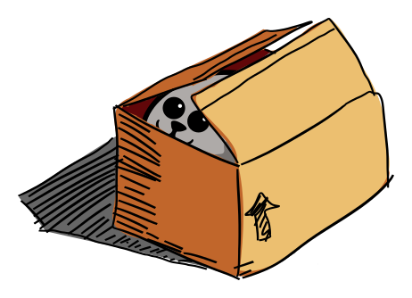
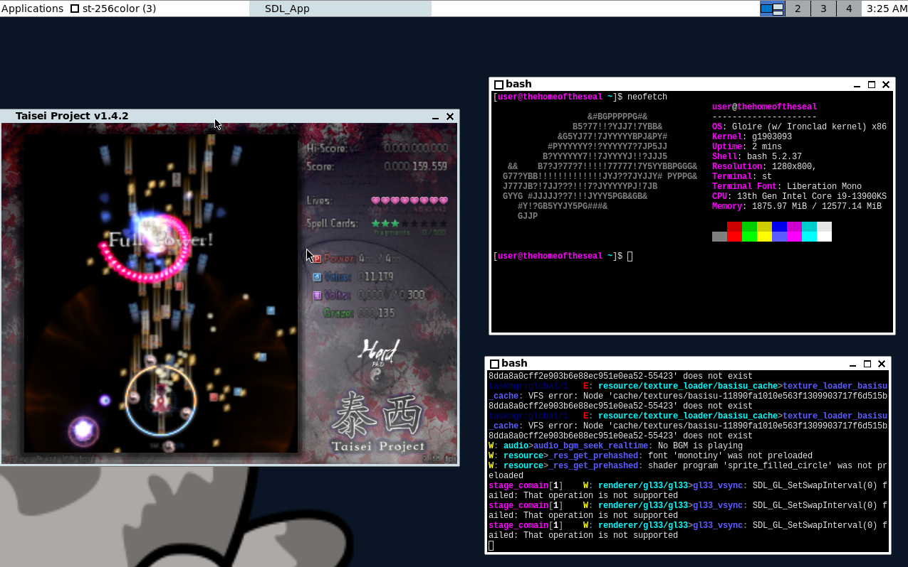

# Gloire

[]()

Gloire is an OS built with the [Ironclad](https://ironclad-os.org)
kernel and using GNU tools for the userland, along with some original
applications like `util-ironclad`. This repository holds scripts and tools to
build the OS from the ground up on a Linux-based system.

Gloire is named after the [french ironclad](https://en.wikipedia.org/wiki/French_ironclad_Gloire),
which was the first ocean-going vessel of its kind.





## Downloading

One can grab a pre-built Gloire image [here](https://codeberg.org/Ironclad/Gloire/releases).

## Running

> [!IMPORTANT]
> For disk images, the minimum amount of memory is 500M for the graphical
> targets and 200M for the terminal-only ones.
>
> For information on the current hardware requirements of the
> kernel, please visit [Ironclad's hardware support section](https://ironclad-os.org/supportedhardware.html).

### On virtual machines

One can run either the downloaded disk image (uncompressing it first) or a
built image with an emulator like QEMU. For using QEMU with an x86_64
image, one can do:

```bash
qemu-system-x86_64 -enable-kvm -cpu host,migratable=off -m 8G -M q35 -drive format=raw,file=gloire.img -serial stdio
```

Where `gloire.img` is your image of choice.

> [!IMPORTANT]
> Ironclad supports SATA and NVMe drives, not ATA, which emulators like QEMU
> will use by default unless told otherwise! If you are using QEMU, please use
> the `-M q35` flag to change the default disk controller to SATA, among other
> changes, or do similar fixes.

To do the same with a riscv64 image, you can do:

```bash
qemu-system-riscv64 -M virt,acpi=on -cpu rv64 -device ramfb -device qemu-xhci \
  -m 4G -device usb-kbd -device usb-mouse -serial stdio \
  -drive if=pflash,unit=0,format=raw,file=<firmware image> \
  -drive id=disk,file=gloire.img,if=none -device ahci,id=ahci \
  -device ide-hd,drive=disk,bus=ahci.0
```

For riscv64, firmware can be obtained [from the EDK2 project](https://github.com/osdev0/edk2-ovmf-nightly/releases/latest/download/ovmf-code-riscv64.fd),
and must be prepared as per QEMU with a

```bash
dd if=/dev/zero of=<firmware path> bs=1 count=0 seek=33554432
```

> [!NOTE]
> Depending on your distribution, to use Linux's KVM, you might need to add your
> user to the `kvm` usergroup, as such:
> ```bash
> usermod -aG kvm <user>
> ```

### On physical hardware

Gloire should run fine on any x86 machine, be it UEFI or BIOS. For running it,
one can burn your gloire image (uncompressing it first if downloaded) to a
SATA or NVMe drive.

## Contributing and bug reporting

Gloire accepts contributions for new packages or any other kind of changes
using the pull request system baked into Codeberg. Check our
[contribution information](CONTRIBUTING.md).

## Joining the community

You can visit our list of community channels on Ironclad's
[community tab](https://ironclad-os.org/community.html).

## Building

A list of the tools needed for compilation of the OS are:

- POSIX-compatible `sh`, `awk`, a working `cc`, `find`, `free` (usually from `procps`), `git`, `GNU make`, `grep`, `gzip`, `perl`, `pkg-config` (or `pkgconf`), `tar`, `unshare` (from `util-linux`), `wget`, `xargs` (usually from `findutils`), `zstd`, `libarchive(-dev)`, `libssl(-dev)/openssl(-dev)`, and `zlib(-dev)` (AKA `zlib1g-dev` on Debian-based distros) for Jinx.
- `sgdisk` (from the `gdisk` or `gptfdisk` package) for building the final disk image.
- `qemu` for testing, if wanted.

The project uses `jinx` as its build system, which is included in the tree.
The instructions to build an x86_64 system are:

```bash
mkdir build-x86_64 && cd build-x86_64
PKGS_TO_INSTALL="*" ../build-support/makeimg.sh
```

> [!NOTE]
> On certain distros, like Ubuntu 24.04, one may get an error like:
> ```
> unshare: write failed /proc/self/uid_map: Operation not permitted
> ```
> In that case, it likely means apparmor is preventing the use of user namespaces,
> which `jinx` needs. One can enable user namespaces by running:
> ```sh
> sudo sysctl kernel.apparmor_restrict_unprivileged_userns=0
> ```
> This is not permanent across reboots. To make it so, one can do:
> ```sh
> sudo sh -c 'echo "kernel.apparmor_restrict_unprivileged_userns = 0" >/etc/sysctl.d/99-userns.conf'
> ```

The image size will default to 4G, this may be too big or too small for the
selection of packages the user may have built the image with. To change
this value, use the environment variable `IMAGE_SIZE`.

To build the riscv64 port, one can instead use:

```bash
mkdir build-riscv64 && cd build-riscv64
PKGS_TO_INSTALL="*" ../build-support/makeimg.sh
```

Regardless of architecture, if, instead of building all packages, building
a minimal command-line only environment is desired, instead of `"*"`, one
can pass `""` (or a list of desired packages, `base` is implied) as `PKGS_TO_INSTALL`.

Any of those routes will generate a bootable disk image that can be burned to
storage media or be booted by several emulators.

## Licensing

A non-exhaustive list of the licenses used by the software ported to Gloire is:

- [GPLv3 (Or-Later and Only)](https://www.gnu.org/licenses/gpl-3.0.html)
- [GPLv2 (Or-Later and Only)](https://www.gnu.org/licenses/old-licenses/gpl-2.0.html)
- [The Less License](https://github.com/gwsw/less/blob/master/LICENSE)
- [MIT License](https://opensource.org/licenses/MIT)
- [BSD 2-Clause](https://opensource.org/licenses/BSD-2-Clause)

## Thanks to

- [Mintsuki](https://codeberg.org/Mintsuki) for the
[Limine Bootloader](https://codeberg.org/Limine/Limine) and
[Jinx](https://codeberg.org/Mintsuki/jinx).
- [The Managarm Project](https://github.com/managarm) for help with some
of the recipes and [mlibc](https://github.com/managarm/mlibc).
