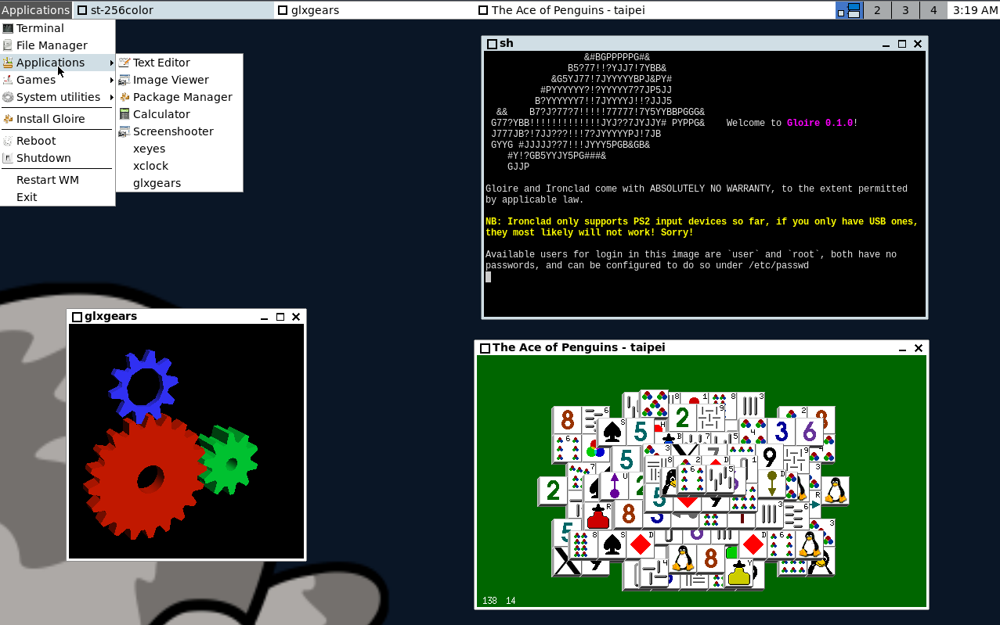

# Gloire

[]()

Gloire is an OS built with the [Ironclad](https://ironclad.nongnu.org)
kernel and using GNU tools for the userland, along with some original
applications like `util-ironclad`. This repository holds scripts and tools to
build the OS from the ground up on a Linux-based system.

Gloire is named after the [french ironclad](https://en.wikipedia.org/wiki/French_ironclad_Gloire),
which was the first ocean-going vessel of its kind.


*Gloire running the JWM window manager, a terminal emulator, xeyes, and a game*

*Gloire generating an RSA key and running neofetch in its fallback shell.*

## Downloading

One can grab a pre-built Gloire image [here](https://github.com/streaksu/Gloire/releases).

## Running

Gloire as built from this repository will result in a live non-persistent image
with the option for installing. So keep in mind that when doing changes to the
filesystem.

### On virtual machines

One can run either the downloaded disk image (uncompressing it first) or a
built image with an emulator like QEMU, for using QEMU with an x86_64
image, one can do:

```bash
qemu-system-x86_64 -enable-kvm -cpu host -smp 4 -m 4G -M q35 -drive format=raw,file=gloire.iso -serial stdio
```

Where `gloire.iso` is your image of choice.

To do the same with a riscv64 image, you can do:

```bash
qemu-system-riscv64 -M virt,acpi=off -cpu rv64 -smp 4 -device ramfb -device qemu-xhci        \
   -device usb-kbd -device usb-mouse -drive if=pflash,unit=0,format=raw,file=<firmware path> \
   -hda gloire.iso -serial stdio -m 4G
```

For riscv64, firmware can be obtained [from the EDK2 project](https://github.com/osdev0/edk2-ovmf-nightly/releases/latest/download/ovmf-code-riscv64.fd),
and must be prepared as per QEMU with a

```bash
dd if=/dev/zero of=<firmware path> bs=1 count=0 seek=33554432
```

Depending on your distribution, to use Linux's KVM, you might need to add your
user to the `kvm` usergroup, as such:

```bash
usermod -aG kvm <user>
```

### On physical hardware

Gloire should run fine on any x86 machine, be it UEFI or BIOS. For running it,
one can burn your gloire image (uncompressing it first if downloaded) to a
SATA, IDE, or USB drive.

## Contributing

Gloire accepts contributions for new packages or any other kind of changes
using the pull request system baked into Github.
Please [submit PRs here](https://github.com/streaksu/Gloire/pulls) or read
our documentation on how to do so and some things to keep in mind porting on
[the project's wiki](https://github.com/streaksu/Gloire/wiki).

## Building

The project uses `jinx` as its build system, which is included in the tree.
The instructions to build an x86_64 system are:

```bash
PKGS_TO_INSTALL="*" ./build-support/makeiso.sh # Create the image.
```

*Note:* on certain distros, like Ubuntu 24.04, one may get an error like:
```
.../.jinx-cache/rbrt: failed to open or write to /proc/self/setgroups at line 186: Permission denied
```
In that case, it likely means apparmor is preventing the use of user namespaces,
causing `jinx` to fail to work. One can enable user namespaces by running:
```sh
sudo sysctl kernel.apparmor_restrict_unprivileged_userns=0
```
This is not permanent across reboots. To make it so, one can do:
```sh
sudo sh -c 'echo "kernel.apparmor_restrict_unprivileged_userns = 0" >/etc/sysctl.d/99-userns.conf'
```

To build the very experimental riscv64 port, one can instead use:

```bash
PKGS_TO_INSTALL="*" JINX_CONFIG_FILE=jinx-config-riscv64 ./build-support/makeiso.sh # Create the image.
```

Regardless of architecture, if, instead of building all packages, building
a minimal command-line only environment is desired, instead of `"*"`, one
can pass `""` (or a list of desired packages, `base` is implied) as `PKGS_TO_INSTALL`.

Any of those routes will generate a bootable disk image that can be burned to
storage media or be booted by several emulators.

A list of the tools needed for compilation of the OS are:

- `git` for cloning packages.
- `curl` and a working C compiler (as `cc`) for setting up jinx.
- Common UNIX tools like `bash`, `coreutils`, `grep`, `find`, etc.
- `sgdisk` from the `gptfdisk` package for building the image.
- `qemu` for testing, if wanted.
- `tar` and `lzip` for extracting packages.
- `rsync` for building bootable images.
- `xorriso` to build the final ISO file.

All of said things can be installed in debian-based systems with

```bash
sudo apt install lzip git build-essential rsync xorriso
```

## Licensing

A list of the licenses used by the software ported to Gloire is:

- [GPLv3 (Or-Later and Only)](https://www.gnu.org/licenses/gpl-3.0.html)
- [GPLv2 (Or-Later and Only)](https://www.gnu.org/licenses/old-licenses/gpl-2.0.html)
- [The Less License](https://github.com/gwsw/less/blob/master/LICENSE)
- [MIT License](https://opensource.org/licenses/MIT)
- [BSD 2-Clause](https://opensource.org/licenses/BSD-2-Clause)

## Thanks to

- [mintsuki](https://github.com/mintsuki) for the Limine Bootloader and
[jinx](https://github.com/mintsuki/jinx).
- [The Managarm Project](https://github.com/managarm) for help with some
of the recipes and [mlibc](https://github.com/managarm/mlibc).
